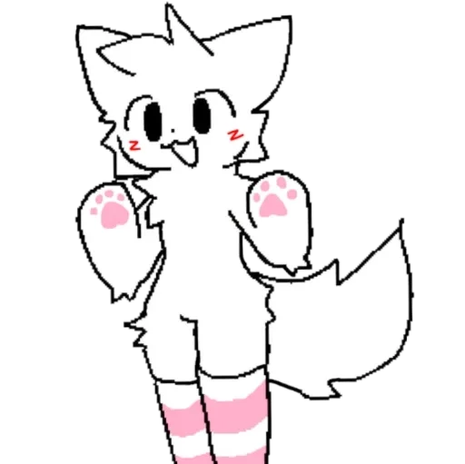

    
    
      
    

<pre>
        pon4ick@fedora:~$ <text id='dots'>...</text>
</pre>

    

        
        

    

    

        
        

    

    

        
        

    

    

        
        

    

